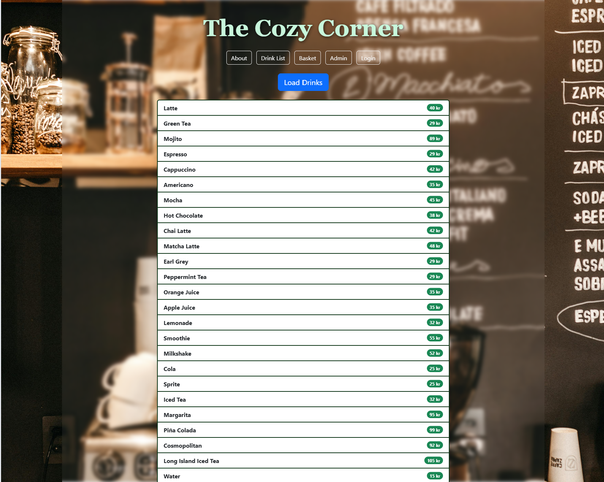
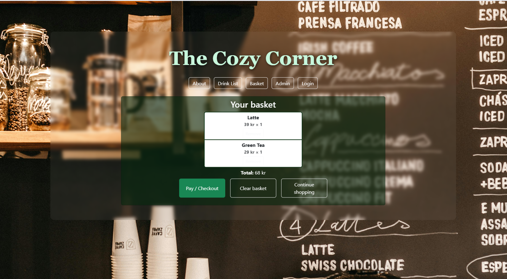
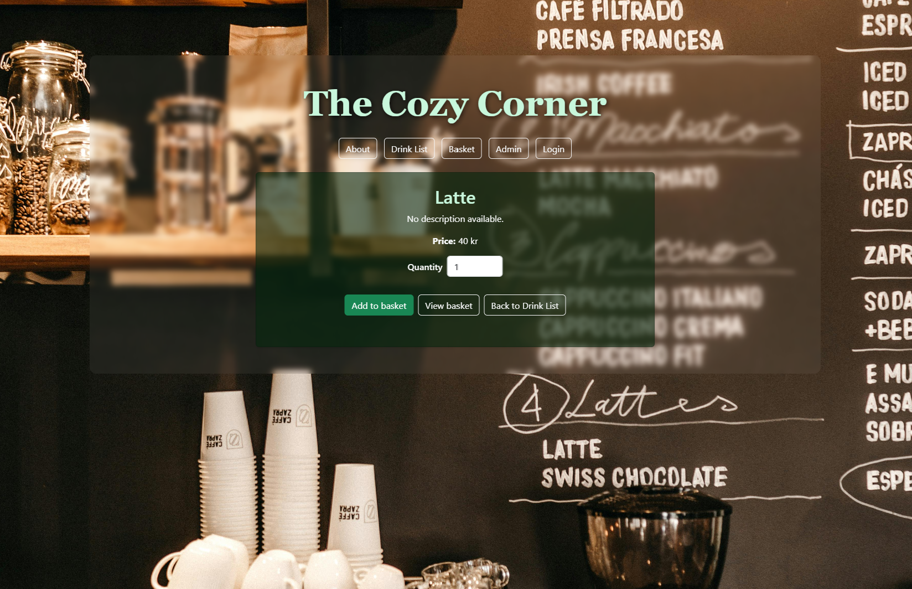
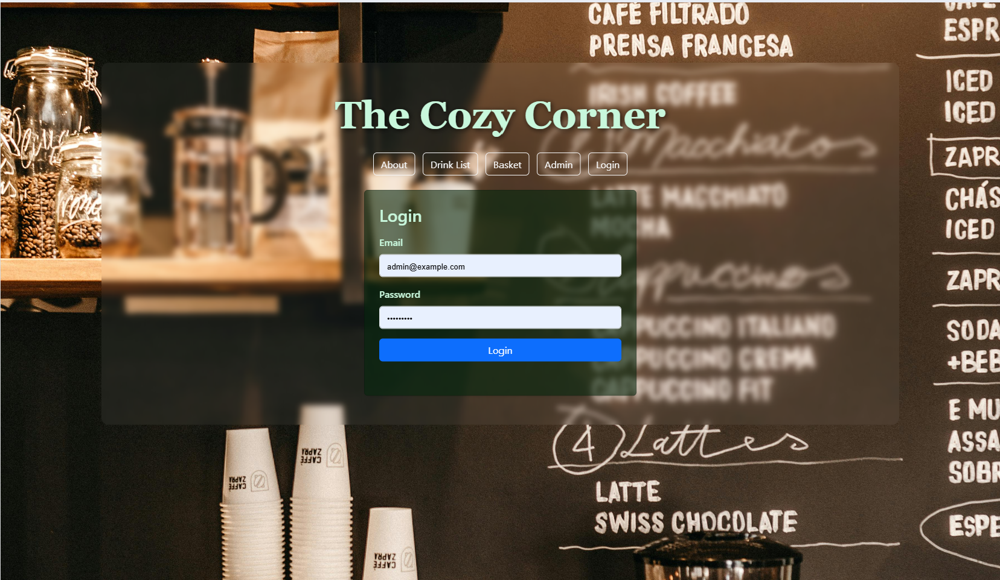
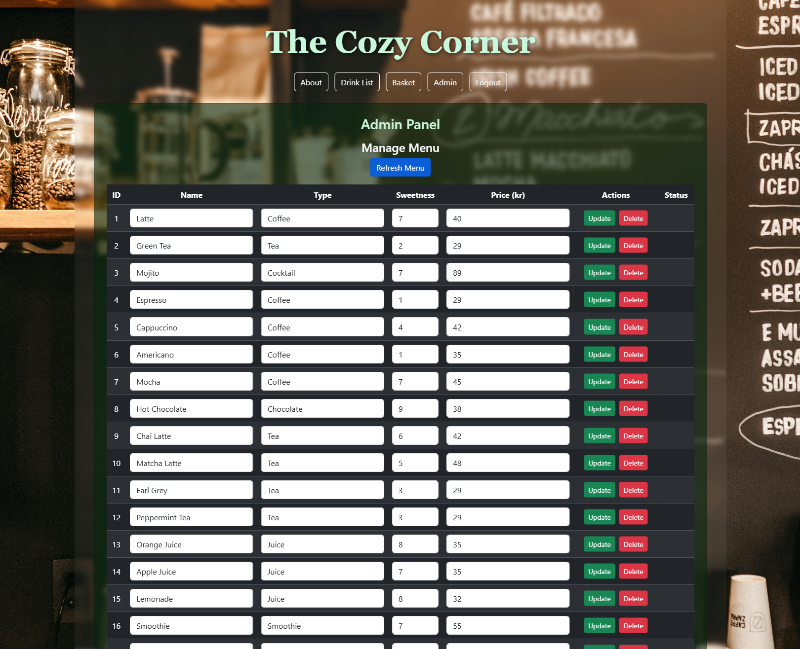
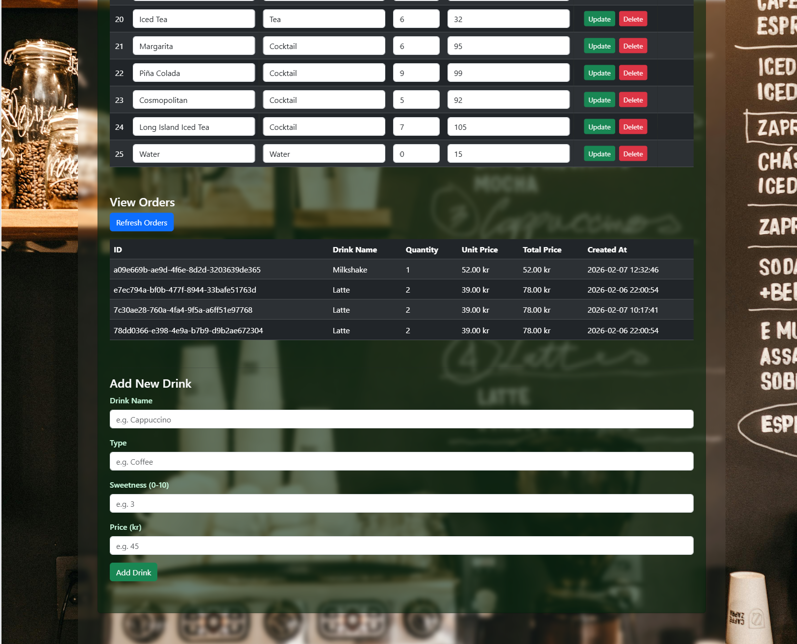

# DrinkApi CozyCafe ☕

A full-stack drink ordering app for a café, built as a personal learning project. It has a .NET Web API backend with role-based authentication, and a vanilla HTML/CSS/JS frontend.

## Backstory

This project started as a simple classroom exercise — a way to practice calling APIs and get comfortable with the basics of JavaScript, CSS, and HTML by building something from scratch.

Along the way, I used AI to guide me, explain the code, and help plan the next steps whenever I got stuck — more of a learning companion than a shortcut. I kept coming back to it, trying out little bits and pieces every time I learned something new in class. I never imagined it would grow into much more than a practice sandbox.

Then one day the idea clicked: why not turn it into a full application with a real UI? That turned out to be one of the most interesting and rewarding parts of the whole journey — and this little practice project ended up becoming one of my favorite things I've built.

## Screenshots

| Home | Menu |
|---|---|
|  |  |

| Cart | Order |
|---|---|
|  |  |

| Login | Admin |
|---|---|
|  |  |

| Admin (menu management) |
|---|
|  |

## Tech stack

**Backend**
- ASP.NET Core Web API (.NET 10)
- Entity Framework Core 10 + SQL Server (LocalDB for local dev)
- ASP.NET Core Identity (roles: `Admin`, `User`)
- JWT Bearer authentication
- Swagger / OpenAPI (Swashbuckle)

**Frontend**
- Plain HTML, CSS, and JavaScript (no framework)
- Bootstrap 5.3 (via CDN) for layout/styling

## Project structure

```
DrinkApi_CozyCafe/
├── DrinkApi/                  # Backend (ASP.NET Core Web API)
│   ├── Controllers/           # Auth, Drinks, Orders endpoints
│   ├── Services/              # Business logic
│   ├── Data/                  # DbContext, Repository, Unit of Work
│   ├── DTOs/                  # Request/response contracts
│   ├── Models/                # EF Core entities
│   ├── Middleware/            # Centralized error handling
│   ├── Extensions/            # DI registration
│   └── Migrations/            # EF Core migrations
├── Drink-Frontend/
│   ├── pages/                 # HTML pages
│   ├── scripts/               # JavaScript
│   ├── styles/                # CSS
│   └── images/
└── DrinkApi.slnx
```

## Architecture

The backend follows a layered architecture: **Controller → Service → Repository (Unit of Work) → EF Core**. DTOs keep the API contract separate from the EF Core models, and a repository/unit-of-work pair batches database writes behind a single `SaveChangesAsync()` call per request.

## Getting started

### Prerequisites
- [.NET 10 SDK](https://dotnet.microsoft.com/download)
- SQL Server LocalDB (comes with Visual Studio, or install separately)
- A code editor (Visual Studio 2026 recommended) and, optionally, the [Live Server](https://marketplace.visualstudio.com/items?itemName=ritwickdey.LiveServer) extension for the frontend

### 1. Clone the repo
```bash
git clone https://github.com/MammaGula/DrinkApi_CozyCafe.git
cd DrinkApi_CozyCafe
```

### 2. Configure secrets (backend)
The JWT signing key and default admin/user passwords are **not** committed to the repo. Set them locally with [.NET User Secrets](https://learn.microsoft.com/aspnet/core/security/app-secrets):

```bash
cd DrinkApi
dotnet user-secrets set "Jwt:Key" "<a random 64-byte base64 string>"
dotnet user-secrets set "DefaultAdmin:Password" "<your choice>"
dotnet user-secrets set "DefaultUser:Password" "<your choice>"
```

> On first run with `SeedData:Enabled` set to `true` in `appsettings.json`, the app seeds a default admin (`admin@example.com`) and a default user (`user@example.com`) using the passwords above.

### 3. Run the backend
```bash
dotnet run
```
This applies EF Core migrations, seeds the database, and starts the API. On success you'll see the listening URLs in the console (typically `http://localhost:5211` and `https://localhost:7041`).

Swagger UI is available at:
```
http://localhost:5211/swagger
```

### 4. Run the frontend
Open `Drink-Frontend/pages/index.html` with Live Server (default port `5500`). The allowed CORS origins are configured in `DrinkApi/appsettings.json` under `Cors:AllowedOrigins` — update this list if you serve the frontend from a different port or domain.

## API overview

All endpoints are prefixed with `/api`.

| Method | Endpoint | Auth | Description |
|---|---|---|---|
| POST | `/Auth/login` | — | Log in and receive a JWT |
| GET | `/Auth/me` | Bearer token | Get the current user's info |
| GET | `/Drinks` | — | List all drinks |
| GET | `/Drinks/{id}` | — | Get a single drink |
| POST | `/Drinks` | Admin | Create a drink |
| PUT | `/Drinks/{id}` | Admin | Update a drink |
| DELETE | `/Drinks/{id}` | Admin | Delete a drink |
| GET | `/Orders` | Admin | List all orders |
| GET | `/Orders/{id}` | Admin | Get a single order |
| POST | `/Orders` | — | Place an order |

Full request/response schemas are available in Swagger once the backend is running.

## Status

This is a personal learning project. It's paused while the author works on another project, and development will resume later.
## 👨‍💻 Developer

**Supaphit** — Newton Yrkeshögskola, SYSM9, VT26


